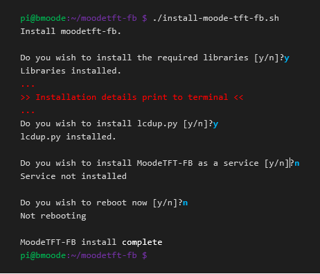

# versions
0.0.1 - initial version for moode 6.5.2

0.0.2 - update for changed location of radio icons
# moodetft-fb
Moode now playing on TFT framebuffer (/dev/fb1)

0.1.4 - update for change on moode coverurl

# Note

The code for the framebuffer (framebuffer.py) is from http://github.com/robertmuth/Pytorinox

## Assumptions ##

1. You have Moode working on a Raspberry pi

2. You have an ILI9341 320*240 TFT display like this connected to the RPi:

    

3. The TFT displays /dev/fb1

    [Here is the HowTo on getting an ILI9341 TFT working as a framebuffer display](https://github.com/rusconi/Raspberry-Pi-TFT-FB1-HowTo)

## Preparation ##

In the Local Services section of Moode's System Config;

* Ensure 'Metadata file' is on


## Installation ##

1. SSH into the RPi

2. Download the scripts

    ```bash
    git clone https://github.com/rusconi/moodetft-fb.git
    cd /home/pi/moodetft-fb
    ```


3. Install python scripts and required libraries

    The install script has 4 steps which can be run/not rub by answering y or n at the appropriate prompt
    - install required libraries
    - install MoodeTFT-FB as a service
    - reboot the RPi

    The first step is necessary for the python scripts to display on the TFT. Install these for testing.

    How to install for testing...

    

    ### Testing ###

    you may have to change permissions on the following files.
    
    ```bash
    chmod +x fbup.py framebuffer.py install-moode-tft-fb.sh moodetft-fb.sh clear_tftfb.py
    ```
    To test after installing libraries and lcdup.py:

    ```bash
    cd /home/pi/moodetft-fb
    ./fbup.py
    ```

    If the test is successful and you want the display to start on boot,
    
    you can run `install-moode-tft-fb.sh` again to install the service and reboot.

 ### Configuration ###

 The text display configuration is in the file config.yml

 Use an online color picker to choose the color you want and the copy the RGB values to the 

 corresponding places in config.yml

 You can also change how to highlight text.
 
 0. No highlight
 1. outline
 2. shadow

 
